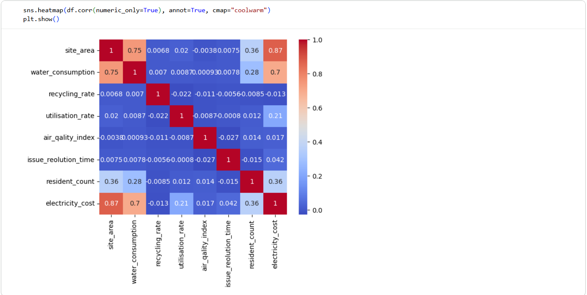
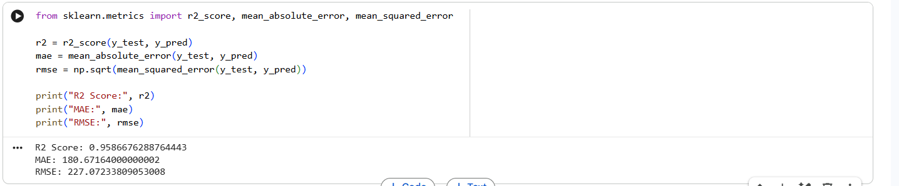
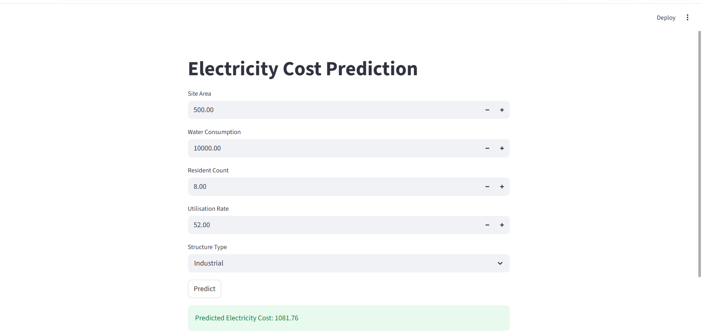

# Electricity Cost Prediction

## Project Overview
Machine Learning project that predicts electricity cost using building infrastructure data with Random Forest, FastAPI backend, and Streamlit frontend.

The project demonstrates a complete machine learning pipeline including:
- Exploratory Data Analysis (Correlation analysis was performed to understand relationships between features.)
- Model Training 
- FastAPI backend for predictions
- Streamlit frontend for user interaction
  
## DATASET FEATURES
The model uses the following features:
- site_area
- water_consumption
- resident_count
- utilisation_rate
- structure_type
  
## MODEL
Random Forest Regressor was used to train the prediction model.

Random Forest is an ensemble learning algorithm that combines multiple
decision trees to improve prediction accuracy and reduce overfitting.

## MODEL PERFORMANCE
The model was evaluated using standard regression metrics.
| Metric   |VALUE|
|----------|-----|
| R² Score | 0.95|
| MAE      | 180 |
| RMSE     | 227 |

Performance visualization:


## PROJECT ARCHITECTURE
Dataset
   ↓
Exploratory Data Analysis
   ↓
Feature Engineering
   ↓
Model Training
   ↓
Saved Model (.pkl)
   ↓
FastAPI Backend
   ↓
Streamlit Frontend(The trained model is integrated with a Streamlit interface that allows users to input building parameters and predict electricity cost.)

## TRAINED MODEL
The trained model is hosted externally due to GitHub file size limitations.
Download model:https://drive.google.com/file/d/16ApJLe55G-i0s4vro2AqTMnQSyGba3Mv/view?usp=sharing

### TECH STACK
- Python
- Scikit-learn
- FastAPI
- Streamlit
- Pandas
- NumPy
- Matplotlib
- Seaborn

### PROJECT STRUCTURE

```
electricity-cost-prediction
│
├── backend
│   └── main.py
│
├── frontend
│   └── streamlit_app.py
│
├── dataset
│   └── electricity_cost_dataset.csv
│
├── notebooks
│   └── eda_training.ipynb
│
├── images
│   ├── heatmap.png
│   ├── model_metrics.png
│   └── streamlit_ui.png
│
├── requirements.txt
└── README.md
```

